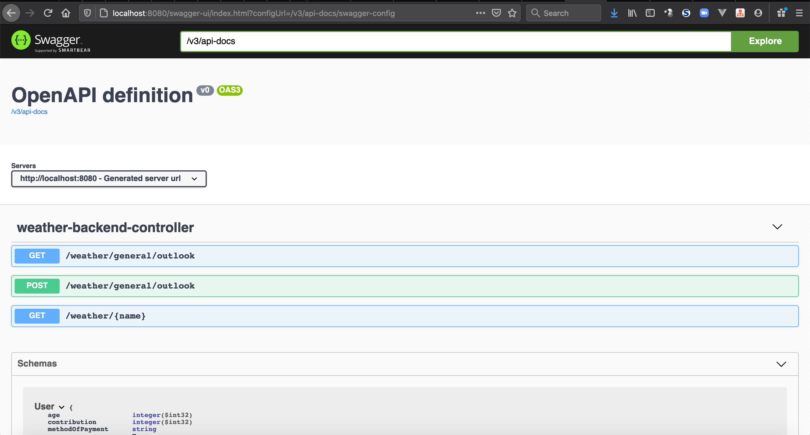
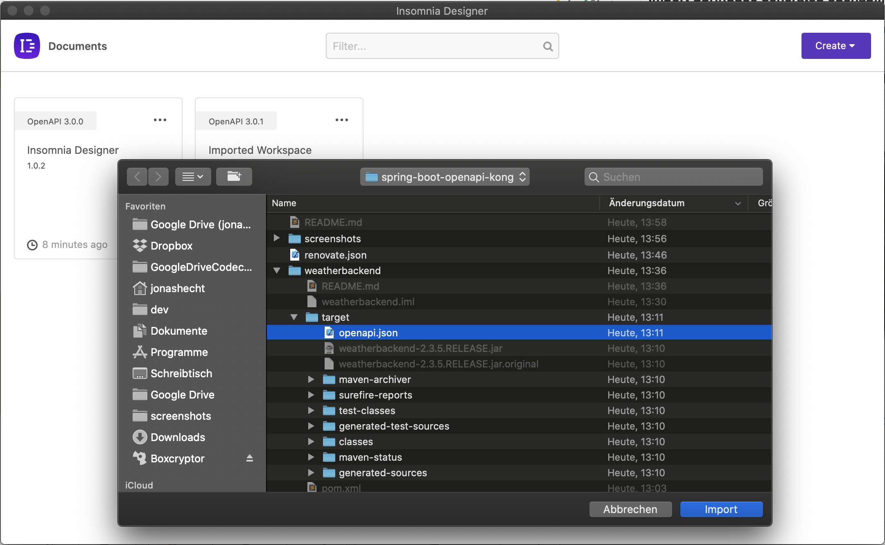
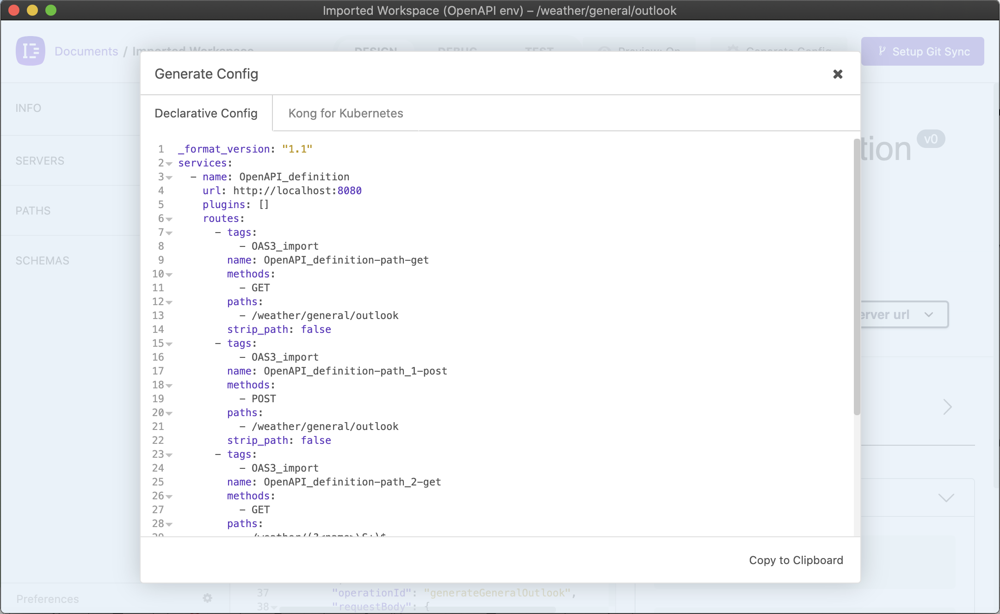
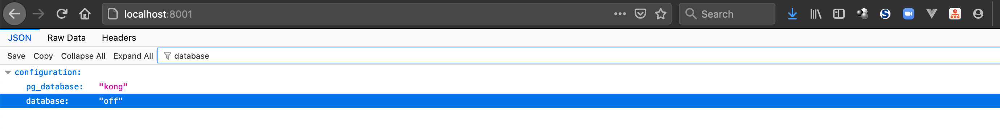
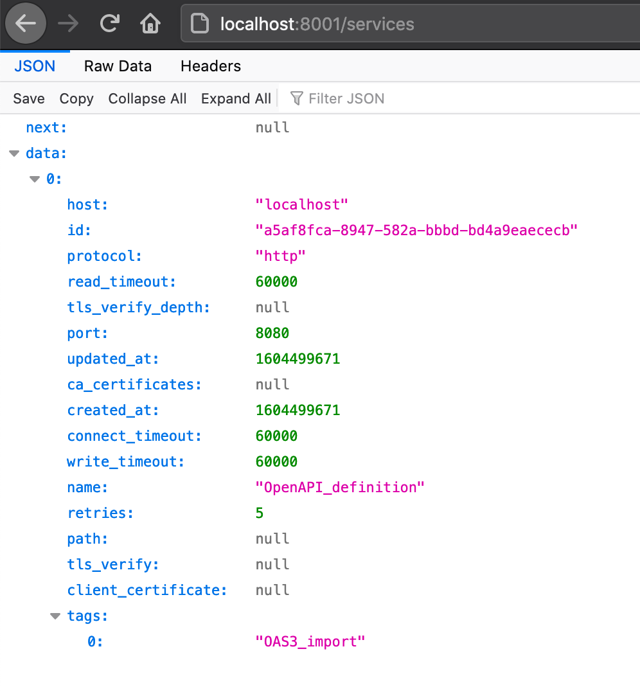
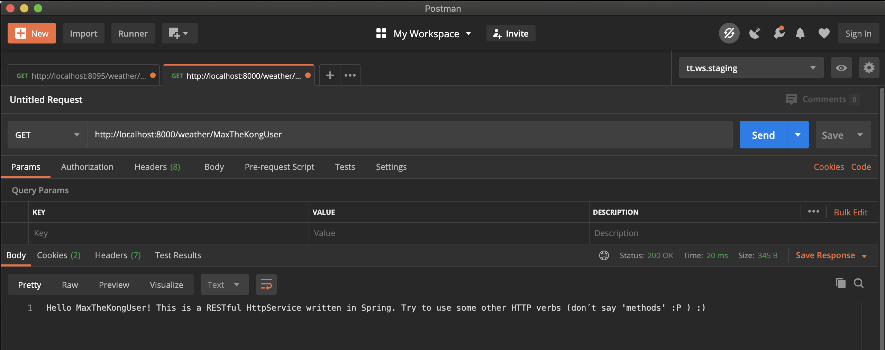

# spring-boot-openapi-kong

[](https://travis-ci.com/jonashackt/spring-boot-openapi-kong)
[](https://github.com/jonashackt/spring-boot-openapi-kong/actions)
[](https://github.com/jonashackt/spring-boot-buildpack/blob/master/LICENSE)
[](https://renovatebot.com)
[](https://github.com/spring-projects/spring-boot)


Example project showing how to integrate Spring Boot microservices with Kong API Gateway

[](https://asciinema.org/a/370557)


Bringing together Kong & Spring Boot. But wait, what is https://github.com/Kong/kong ?

> Kong is a cloud-native, fast, scalable, and distributed Microservice Abstraction Layer (also known as an API Gateway or API Middleware). 

### Idea & Setup

Some microservices to access with Kong... I once worked heavily with the Spring Cloud Netflix tooling.

Here's the example project: https://github.com/jonashackt/cxf-spring-cloud-netflix-docker and the blog post I wrote back then https://blog.codecentric.de/en/2017/05/ansible-docker-windows-containers-scaling-spring-cloud-netflix-docker-compose

The goal is to rebuild the project using Kong https://github.com/Kong/kong


agnostical! more pattern like

Setup idea: Spring Boot REST --> [generate OpenAPI spec yamls via springdoc-openapi-maven-plugin](https://www.baeldung.com/spring-rest-openapi-documentation) --> Insomnia: Kong config file with [Kong Bundle plugin](https://insomnia.rest/plugins/insomnia-plugin-kong-bundle/) --> import into Kong and run via decK (normal Kong gateway without EE)

Nothing really there right now:  https://www.google.com/search?q=openapi+spring+boot+kong

* No change in Spring Boot dev workflow required, no custom annotations
* elegant integration of Kong and Spring Boot services

PLUS: CI process to regularly generate OpenAPI specs from Spring code -> and automatically import into Kong, which is an enterprise feature - or it is possible via:


## Step by step...


### The current problem with springdoc-openapi and WebFlux based Spring Boot apps

Why didn't I go with a reactive WebFlux based app? 

WebFlux based Spring Boot Apps need some `springdoc-openapi` specific classes right now in order to fully generate the OpenAPI live documentation in the end. See the demos at

https://github.com/springdoc/springdoc-openapi-demos

And especially the webflux functional demo at: https://github.com/springdoc/springdoc-openapi-demos/blob/master/springdoc-openapi-spring-boot-2-webflux-functional where these imports are used:

```java
import static org.springdoc.core.fn.builders.apiresponse.Builder.responseBuilder;
import static org.springdoc.core.fn.builders.parameter.Builder.parameterBuilder;
import static org.springdoc.webflux.core.fn.SpringdocRouteBuilder.route;
```

I can fully discourage to go with this approach, but for this project I wanted a 100% "springdoc-free" standard Spring Boot app, where the springdoc feature are __ONLY__ used to generate OpenAPI specs - and not rely onto some dependencies from springdoc. Since that would imply that every Spring Boot project that wanted to adopt the solution outlined here would need to integrate springdoc classes in their projects.


### Create a Spring Boot App with REST endpoints

This is the easy part. We all know where to start: Go to start.spring.io and create a Spring REST app skeleton.

As I wanted to rebuild my good old Spring Cloud Netflix / Eureka based apps, I simply took the `weatherbackend` app from https://github.com/jonashackt/cxf-spring-cloud-netflix-docker/tree/master/weatherbackend

Here's the [WeatherBackendAPI.java](weatherbackend/src/main/java/io/jonashackt/weatherbackend/api/WeatherBackendAPI.java) - nothing special here:

```java
package io.jonashackt.weatherbackend.api;

import com.fasterxml.jackson.core.JsonProcessingException;
import com.fasterxml.jackson.databind.ObjectMapper;
import io.jonashackt.weatherbackend.businesslogic.IncredibleLogic;
import io.jonashackt.weatherbackend.model.*;
import org.slf4j.Logger;
import org.slf4j.LoggerFactory;
import org.springframework.http.HttpStatus;
import org.springframework.web.bind.annotation.*;

@RestController
@RequestMapping("/weather")
public class WeatherBackendAPI {

    private static final Logger LOG = LoggerFactory.getLogger(WeatherBackendController.class);

    private ObjectMapper objectMapper = new ObjectMapper();;

    @RequestMapping(path = "/general/outlook", method=RequestMethod.POST, produces="application/json")
    @ResponseStatus(HttpStatus.OK)
    public @ResponseBody GeneralOutlook generateGeneralOutlook(@RequestBody Weather weather) throws JsonProcessingException {
        ...
        return outlook;
    }

    @RequestMapping(path = "/general/outlook", method=RequestMethod.GET, produces="application/json")
    @ResponseStatus(HttpStatus.OK)
    public @ResponseBody String infoAboutGeneralOutlook() throws JsonProcessingException {
        ...
        return "Try a POST also against this URL! Just send some body with it like: '" + weatherJson + "'";
    }

    @RequestMapping(value = "/{name}", method = RequestMethod.GET, produces = "text/plain")
    public String whatsTheSenseInThat(@PathVariable("name") String name) {
        LOG.info("Request for /{name} with GET");
        return "Hello " + name + "! This is a RESTful HttpService written in Spring. :)";
    }
}
```


### Generate an OpenAPI spec with the springdoc-openapi-maven-plugin

See the docs at https://github.com/springdoc/springdoc-openapi-maven-plugin on how to use the springdoc-openapi-maven-plugin.

> The aim of springdoc-openapi-maven-plugin is to generate json and yaml OpenAPI description during build time. The plugin works during integration-tests phase, and generates the OpenAPI description. The plugin works in conjunction with spring-boot-maven plugin.

But in order to successfully run the springdoc-openapi-maven-plugin, we need to add the [springdoc-openapi-ui](https://github.com/springdoc/springdoc-openapi) plugin (for Tomcat / Spring MVC based apps) or the [springdoc-openapi-webflux-ui](https://github.com/springdoc/springdoc-openapi#spring-webflux-support-with-annotated-controllers) plugin (for Reactive WebFlux / Netty based apps) to our [hellobackend/pom.xml](hellobackend/pom.xml):

```xml
<dependency>
    <groupId>org.springdoc</groupId>
    <artifactId>springdoc-openapi-webflux-ui</artifactId>
    <version>1.4.8</version>
</dependency>
```

Otherwise the `springdoc-openapi-maven-plugin` will run into errors like this (as described [in this so answer](https://stackoverflow.com/a/64677754/4964553)):

```
[INFO] --- springdoc-openapi-maven-plugin:1.1:generate (default) @ hellobackend ---
[ERROR] An error has occured: Response code 404
[INFO]
[INFO] --- spring-boot-maven-plugin:2.3.5.RELEASE:stop (post-integration-test) @ hellobackend ---
[INFO] Stopping application...
2020-11-04 10:18:36.851  INFO 42036 --- [on(4)-127.0.0.1] inMXBeanRegistrar$SpringApplicationAdmin : Application shutdown requested.
```

As a sidenote: if you fire up your Spring Boot app from here with `mvn spring-boot:run`, you can access the live API documentation already at http://localhost:8080/swagger-ui.html



Now we can add the `springdoc-openapi-maven-plugin` to our [hellobackend/pom.xml](hellobackend/pom.xml):

```xml
	<build>
		<plugins>
			<plugin>
				<groupId>org.springframework.boot</groupId>
				<artifactId>spring-boot-maven-plugin</artifactId>
				<executions>
					<execution>
						<id>pre-integration-test</id>
						<goals>
							<goal>start</goal>
						</goals>
					</execution>
					<execution>
						<id>post-integration-test</id>
						<goals>
							<goal>stop</goal>
						</goals>
					</execution>
				</executions>
			</plugin>
			<plugin>
				<groupId>org.springdoc</groupId>
				<artifactId>springdoc-openapi-maven-plugin</artifactId>
				<version>1.1</version>
				<executions>
					<execution>
						<phase>integration-test</phase>
						<goals>
							<goal>generate</goal>
						</goals>
					</execution>
				</executions>
			</plugin>
		</plugins>
	</build>
``` 

As you see we also need to tell the `spring-boot-maven-plugin` to start and stop the integration test phases.

In order to generate the Open API spec we need to execute Maven with:

```
mvn verify
```

The output should contain something like that:

```
...
[INFO] --- springdoc-openapi-maven-plugin:1.1:generate (default) @ hellobackend ---
2020-11-04 10:26:09.579  INFO 42143 --- [ctor-http-nio-2] o.springdoc.api.AbstractOpenApiResource  : Init duration for springdoc-openapi is: 29 ms
...
```

This indicates that the OpenAPI spec generation was successful. Therefore we need to have a look into the `weatherbackend/target` directory, where a file called [openapi.json](weatherbackend/target/openapi.json) should be present now (you may need to reformat the code inside you IDE to not look into a one-liner ;) ):

```json
{
  "openapi": "3.0.1",
  "info": {
    "title": "OpenAPI definition",
    "version": "v0"
  },
  "servers": [
    {
      "url": "http://localhost:8080",
      "description": "Generated server url"
    }
  ],
  "paths": {
    "/weather/general/outlook": {
      "get": {
        "tags": [
          "weather-backend-controller"
        ],
        "operationId": "infoAboutGeneralOutlook",
        "responses": {
          "200": {
            "description": "OK",
            "content": {
              "application/json": {
                "schema": {
                  "type": "string"
                }
              }
            }
          }
        }
      }
}}}
```

### Tweak the API information in the generated OpenAPI spec

I really don't wanted to change much here in the first place. But as I came into more details regarding the Kong integration, I wanted to configure at least some information in the generated `openapi.json`.

Especially the `"title": "OpenAPI definition"`, which is then used as the Kong service name, should be optimized :)

Therefore we can [use the @OpenAPIDefinition annotation](https://github.com/springdoc/springdoc-openapi#adding-api-information-and-security-documentation) to configure the service info.

So let's create a class [OpenAPIConfig.java](weatherbackend/src/main/java/io/jonashackt/weatherbackend/api/OpenAPIConfig.java) and specify some info:

```java
package io.jonashackt.weatherbackend.api;

import io.swagger.v3.oas.annotations.OpenAPIDefinition;
import io.swagger.v3.oas.annotations.info.Info;
import io.swagger.v3.oas.annotations.servers.Server;

@OpenAPIDefinition(
        info = @Info(
                title = "weatherbackend",
                version = "v2.0"
        ),
        servers = @Server(url = "http://weatherbackend:8080")
)
public class OpenAPIConfig {
}
```

With that we can generate our `openapi.json` again by running `mvn verify -DskipTests=true` and should have the new information propagated:

```json
{
  "openapi": "3.0.1",
  "info": {
    "title": "weatherbackend",
    "version": "v2.0"
  },
  "servers": [
    {
      "url": "http://weatherbackend:8080",
      "variables": {}
    }
  ],
  "paths": {
    "/weather/general/outlook": {
      "get": {
        "tags": [
          "weather-backend-api"
        ],
        "operationId": "infoAboutGeneralOutlook",
        "responses": {
          "200": {
            "description": "OK",
            "content": {
              "application/json": {
                "schema": {
                  "type": "string"
                }
              }
            }
          }
        }
      },
```


### Import OpenAPI spec into Kong

First we start the manual process in order to test drive our solution.

##### Install Insomnia Desinger with Kong Bundle plugin

On a Mac simply use brew (or have a look at https://insomnia.rest):

```
brew cask install insomnia-designer
```

Then go to https://insomnia.rest/plugins/insomnia-plugin-kong-bundle and click on `Install in Designer` & open the request in Insomnia Desinger:


### Import Springdoc generated openapi.json into Insomnia Designer

Now let's try to import the generated [openapi.json](weatherbackend/target/openapi.json) into our Insomnia Designer by clicking on `Create` and then `Import from / File`:



That was easy :) Now you can already interact with your API through Insomnia.


### Generate Kong Declarative Config from Openapi

The next step is to generate the Kong configuration from the OpenAPI specification. Therefore we need to click on the `Generate Config` button:



And voilà we have our Kong declarative configuration ready:

```yaml
_format_version: "1.1"
services:
  - name: weatherbackend
    url: http://weatherbackend:8080
    plugins: []
    routes:
      - tags:
          - OAS3_import
        name: weatherbackend-path-get
        methods:
          - GET
        paths:
          - /weather/general/outlook
        strip_path: false
      - tags:
          - OAS3_import
        name: weatherbackend-path_1-post
        methods:
          - POST
        paths:
          - /weather/general/outlook
        strip_path: false
      - tags:
          - OAS3_import
        name: weatherbackend-path_2-get
        methods:
          - GET
        paths:
          - /weather/(?<name>\S+)$
        strip_path: false
    tags:
      - OAS3_import
upstreams:
  - name: weatherbackend
    targets:
      - target: weatherbackend:8080
    tags:
      - OAS3_import
```

For now let's save this yaml inside the [kong/kong.yml](kong/kong.yml) file.


### Docker Compose with Kong DB-less deployment & declarative configuration

I have two goals here: First I want a simple deployment solution. If I could avoid it then I don't want to have multiple services only for the API gateway. I want to start small and you as a reader should be able to easily follow.

As [the official Docker Compose file](https://github.com/Kong/docker-kong/blob/master/compose/docker-compose.yml) has two (!!) database migration services, one database service and one service for Kong I was really overwhelmed at first.

What I learned in my years in the IT industry: Every component you don't have is a good component. So there must be a way to deploy Kong without that much "hassle". And I found one:

 
The documentation at https://docs.konghq.com/2.2.x/db-less-and-declarative-config/ & https://docs.konghq.com/install/docker says, that DB-less mode is possible since Kong 1.1 and has a number of benefits:

* reduced number of dependencies: no need to manage a database installation if the entire setup for your use-cases fits in memory
* it is a good fit for automation in CI/CD scenarios: configuration for entities can be kept in a single source of truth managed via a Git repository
* it enables more deployment options for Kong

But be aware that are also some drawbacks. [Not all plugins support this mode]https://docs.konghq.com/2.2.x/db-less-and-declarative-config/#plugin-compatibility) and [there is no central configuration database](https://docs.konghq.com/2.2.x/db-less-and-declarative-config/#no-central-database-coordination) if you want to run multiple Kong nodes. But for our simple setup we should be able to live with that. 


But there's another advantage: we don't need to use [decK](https://github.com/Kong/deck) here as my colleague [already outlined](https://blog.codecentric.de/en/2019/12/kong-api-gateway-declarative-configuration-using-deck-and-visualizations-with-konga/) is used with Kong for declarative config handling.

This is only needed, if you use Kong with a Database deployment! If you choose the DB-less/declarative configuration approach, your declarative file is already everything we need! :)


So let's do it. I'll try to setup the simplest possible `docker-compose.yml` here in order to spin up Kong. I'll derive it [from the official one](https://github.com/Kong/docker-kong/blob/master/compose/docker-compose.yml), the one my colleague Daniel Kocot [used in his blog posts](https://github.com/danielkocot/kong-blogposts/blob/master/docker-compose.yml) and others [like this](https://medium.com/@matias_azucas/db-less-kong-tutorial-8cbf8f70b266). 

```yaml
version: '3.7'

services:
  kong:
    image: kong:2.2.0
    environment:
      KONG_ADMIN_ACCESS_LOG: /dev/stdout
      KONG_ADMIN_ERROR_LOG: /dev/stderr
      KONG_ADMIN_LISTEN: '0.0.0.0:8001'
      KONG_DATABASE: "off"
      KONG_DECLARATIVE_CONFIG: /usr/local/kong/declarative/kong.yml
      KONG_PROXY_ACCESS_LOG: /dev/stdout
      KONG_PROXY_ERROR_LOG: /dev/stderr
    volumes:
      - ./kong/:/usr/local/kong/declarative
    networks:
      - kong-net
    ports:
      - "8000:8000/tcp"
      - "127.0.0.1:8001:8001/tcp"
      - "8443:8443/tcp"
      - "127.0.0.1:8444:8444/tcp"
    healthcheck:
      test: ["CMD", "kong", "health"]
      interval: 10s
      timeout: 10s
      retries: 10
    restart: on-failure
    deploy:
      restart_policy:
        condition: on-failure

  # no portbinding here - the actual services should be accessible through Kong
  weatherbackend:
    build: ./weatherbackend
    ports:
      - "8080"
    networks:
      - kong-net
    tty:
      true
    restart:
      unless-stopped

networks:
  kong-net:
    external: false
```

I litterally blew everything out we don't really really need in a DB-less scenario! No `kong-migrations`, `kong-migrations-up`, `kong-db` services - and no extra `Dockerfile` [as shown in this blog post](https://medium.com/@matias_azucas/db-less-kong-tutorial-8cbf8f70b266).

I only wanted to have a single `kong` service for the API gateway - and a `weatherbackend` service that is registered in Kong later.

As stated [in the docs for DB-less deployment](https://docs.konghq.com/install/docker/?_ga=2.266755086.1634614376.1604405282-930789398.1604405282) I used `KONG_DATABASE: "off"` to switch to DB-less mode and `KONG_DECLARATIVE_CONFIG: /usr/local/kong/declarative/kong.yml` to tell Kong where to get the `kong.yml` we generated with the Insomnia Designer's Kong Bungle plugin.
To have the file present at `/usr/local/kong/declarative/kong.yml`, I used a simple volume mount like this: `./kong/:/usr/local/kong/declarative`. No need to manually create the Volume as described in the docs - or to create another Dockerfile solely to load the config file into the Kong container. Simply nothing needed instead of this sweet volume!

Now this thing starts to make fun to me :)

 
Now let's fire up our Kong setup with `docker-compose up`

```
$ docker-compose up
Starting spring-boot-openapi-kong_kong_1           ... done
Starting spring-boot-openapi-kong_weatherbackend_1 ... done
Attaching to spring-boot-openapi-kong_weatherbackend_1, spring-boot-openapi-kong_kong_1
kong_1            | 2020/11/04 14:21:11 [notice] 1#0: using the "epoll" event method
kong_1            | 2020/11/04 14:21:11 [notice] 1#0: openresty/1.17.8.2
kong_1            | 2020/11/04 14:21:11 [notice] 1#0: built by gcc 9.3.0 (Alpine 9.3.0)
kong_1            | 2020/11/04 14:21:11 [notice] 1#0: OS: Linux 5.4.39-linuxkit
kong_1            | 2020/11/04 14:21:11 [notice] 1#0: getrlimit(RLIMIT_NOFILE): 1048576:1048576
kong_1            | 2020/11/04 14:21:11 [notice] 1#0: start worker processes
kong_1            | 2020/11/04 14:21:11 [notice] 1#0: start worker process 22
kong_1            | 2020/11/04 14:21:11 [notice] 1#0: start worker process 23
kong_1            | 2020/11/04 14:21:11 [notice] 1#0: start worker process 24
kong_1            | 2020/11/04 14:21:11 [notice] 1#0: start worker process 25
kong_1            | 2020/11/04 14:21:11 [notice] 23#0: *2 [lua] cache.lua:374: purge(): [DB cache] purging (local) cache, context: init_worker_by_lua*
kong_1            | 2020/11/04 14:21:11 [notice] 23#0: *2 [lua] cache.lua:374: purge(): [DB cache] purging (local) cache, context: init_worker_by_lua*
kong_1            | 2020/11/04 14:21:11 [notice] 23#0: *2 [kong] init.lua:354 declarative config loaded from /usr/local/kong/declarative/kong.yml, context: init_worker_by_lua*
weatherbackend_1  |
weatherbackend_1  |   .   ____          _            __ _ _
weatherbackend_1  |  /\\ / ___'_ __ _ _(_)_ __  __ _ \ \ \ \
weatherbackend_1  | ( ( )\___ | '_ | '_| | '_ \/ _` | \ \ \ \
weatherbackend_1  |  \\/  ___)| |_)| | | | | || (_| |  ) ) ) )
weatherbackend_1  |   '  |____| .__|_| |_|_| |_\__, | / / / /
weatherbackend_1  |  =========|_|==============|___/=/_/_/_/
weatherbackend_1  |  :: Spring Boot ::        (v2.3.5.RELEASE)
weatherbackend_1  |
weatherbackend_1  | 2020-11-04 14:21:13.226  INFO 6 --- [           main] io.jonashackt.weatherbackend.WeatherBackendApplication  : Starting WeatherBackendApplication v2.3.5.RELEASE on 209e8a7cbb36 with PID 6 (/app.jar started by root in /)
weatherbackend_1  | 2020-11-04 14:21:13.239  INFO 6 --- [           main] io.jonashackt.weatherbackend.WeatherBackendApplication  : No active profile set, falling back to default profiles: default
weatherbackend_1  | 2020-11-04 14:21:15.920  INFO 6 --- [           main] o.s.b.w.embedded.tomcat.TomcatWebServer  : Tomcat initialized with port(s): 8080 (http)
weatherbackend_1  | 2020-11-04 14:21:15.958  INFO 6 --- [           main] o.apache.catalina.core.StandardService   : Starting service [Tomcat]
weatherbackend_1  | 2020-11-04 14:21:15.960  INFO 6 --- [           main] org.apache.catalina.core.StandardEngine  : Starting Servlet engine: [Apache Tomcat/9.0.39]
weatherbackend_1  | 2020-11-04 14:21:16.159  INFO 6 --- [           main] o.a.c.c.C.[Tomcat].[localhost].[/]       : Initializing Spring embedded WebApplicationContext
weatherbackend_1  | 2020-11-04 14:21:16.163  INFO 6 --- [           main] w.s.c.ServletWebServerApplicationContext : Root WebApplicationContext: initialization completed in 2714 ms
weatherbackend_1  | 2020-11-04 14:21:16.813  INFO 6 --- [           main] o.s.s.concurrent.ThreadPoolTaskExecutor  : Initializing ExecutorService 'applicationTaskExecutor'
weatherbackend_1  | 2020-11-04 14:21:18.534  INFO 6 --- [           main] o.s.b.w.embedded.tomcat.TomcatWebServer  : Tomcat started on port(s): 8080 (http) with context path ''
weatherbackend_1  | 2020-11-04 14:21:18.564  INFO 6 --- [           main] io.jonashackt.weatherbackend.WeatherBackendApplication  : Started WeatherBackendApplication in 7.188 seconds (JVM running for 8.611)
kong_1            | 172.19.0.1 - - [04/Nov/2020:14:25:16 +0000] "GET / HTTP/1.1" 404 48 "-" "Mozilla/5.0 (Macintosh; Intel Mac OS X 10.15; rv:82.0) Gecko/20100101 Firefox/82.0"
```

A crucial part here is that Kong successfully loads the declarative configuration file and logs something like `[kong] init.lua:354 declarative config loaded from /usr/local/kong/declarative/kong.yml`


If your log looks somehow like the above you can also have a look at the admin API by opening http://localhost:8001/ in your browser. [As the docs state](https://docs.konghq.com/2.2.x/db-less-and-declarative-config/#setting-up-kong-in-db-less-mode) everything should be ok, if the response says `"database": "off"` somewhere like:

  

We can also double check http://localhost:8001/status , where we have a good overview of Kong's current availability.


### Access the Spring Boot app through Kong

The next thing we need to look at is how to access our `weatherbackend` through Kong. Specifically we need to have a look into the configured Kong services, if the OpenAPI spec import worked out in the way we'd expected it in the first place.

Without using Kong's declarative configuration [we need to add services and routes manually through the Kong admin API](https://blog.codecentric.de/en/2019/09/api-management-kong-update/). But as we use declarative configuration, which we generated from the OpenAPI spec, everything is taken care for us already.


Therefore let's have a look into the list of all currently registered Kong services at http://localhost:8001/services 



You can also access the Kong routes of our Spring Boot-backed service with this URL:

http://localhost:8001/services/weatherbackend/routes


### Configuring the correct upstream in Kong (connect() failed (111: Connection refused) while connecting to upstream)

If you run into problems like this:

```
kong_1            | 2020/11/04 18:56:05 [error] 24#0: *14486 connect() failed (111: Connection refused) while connecting to upstream, client: 172.19.0.1, server: kong, request: "GET /weather/Jonas HTTP/1.1", upstream: "http://127.0.0.1:8080/weather/Jonas", host: "localhost:8000"
kong_1            | 2020/11/04 18:56:05 [error] 24#0: *14486 connect() failed (111: Connection refused) while connecting to upstream, client: 172.19.0.1, server: kong, request: "GET /weather/Jonas HTTP/1.1", upstream: "http://127.0.0.1:8080/weather/Jonas", host: "localhost:8000"
kong_1            | 172.19.0.1 - - [04/Nov/2020:18:56:05 +0000] "GET /weather/Jonas HTTP/1.1" 502 75 "-" "insomnia/2020.4.2"
```

we should have a look at the `upstreams` configuration of our generated Kong declarative config:

```yaml
upstreams:
  - name: weatherbackend
    targets:
      - target: localhost:8080
    tags:
      - OAS3_import
```

As with our setup here Kong needs to access the weatherbackend from within the Docker network. So the `upstreams: target` to `localhost` will not work and lead to the error `connect() failed (111: Connection refused) while connecting to upstream`.

So we need to think about a working `host` configuration. [Daniel did the trick](https://blog.codecentric.de/en/2019/09/api-management-kong-update/) to simply use `host.docker.internal` as host name in his post and I also remember it from my last work with Traefik.

Coming from this solution I thought about my [post about the Spring Cloud microservice setup](https://blog.codecentric.de/en/2017/05/ansible-docker-windows-containers-scaling-spring-cloud-netflix-docker-compose) back in 2017: There I simply used the Docker (Compose) service names, which I aligned with the names of the microservices.

So having a look into our [docker-compose.yml](docker-compose.yml) it would be easy to simply use `weatherbackend` as the host name, since that one should be also available inside the Docker network. And: We can enrich this later by using a DNS resolver and so on...

In order to configure another host name inside Kong, we need to tweak our [OpenAPIConfig.java](weatherbackend/src/main/java/io/jonashackt/weatherbackend/api/OpenAPIConfig.java) with another configuration option called `servers`:

```java
@OpenAPIDefinition(
        info = @Info(
                title = "weatherbackend",
                version = "v2.0"
        ),
        servers = @Server(url = "http://weatherbackend:8080")
)
public class OpenAPIConfig {
}
```    

Now doing the OpenAPI spec and Kong declarative config generation again, our setup should come up with a working configuration to access our Spring Boot service through Kong!


Finally we can use Postman, Insomnia Core or the like to access our Spring Boot app with a GET on http://localhost:8000/weather/MaxTheKongUser



Looking into our Docker Compose log we should also see the successful responses from our `weatherbackend` service:

```shell script
weatherbackend_1  | 2020-11-05 07:54:48.381  INFO 7 --- [nio-8080-exec-1] i.j.controller.WeatherBackendController  : Request for /{name} with GET
kong_1            | 172.19.0.1 - - [05/Nov/2020:07:54:48 +0000] "GET /weather/MaxTheKongUser HTTP/1.1" 200 133 "-" "PostmanRuntime/7.26.1"
weatherbackend_1  | 2020-11-05 07:54:59.951  INFO 7 --- [nio-8080-exec-2] i.j.controller.WeatherBackendController  : Request for /{name} with GET
kong_1            | 172.19.0.1 - - [05/Nov/2020:07:54:59 +0000] "GET /weather/MonicaTheKongUser HTTP/1.1" 200 136 "-" "PostmanRuntime/7.26.1"
weatherbackend_1  | 2020-11-05 07:55:06.573  INFO 7 --- [nio-8080-exec-3] i.j.controller.WeatherBackendController  : Request for /{name} with GET
kong_1            | 172.19.0.1 - - [05/Nov/2020:07:55:06 +0000] "GET /weather/MartinTheKongUser HTTP/1.1" 200 136 "-" "PostmanRuntime/7.26.1"
``` 


### Automating the OpenAPI-Kong import

We need to also import the OpenAPI spec everytime the code changes, since otherwise the configuration in Kong will differ with every commit!

Additionally we want to be able to run our process on our CI servers as well, since we're in 2020 and want to be sure everything runs even after code changes.

And there's a way maybe: Inso CLI https://github.com/Kong/insomnia/tree/develop/packages/insomnia-inso

Because there we have a [openapi-2-kong functionality](https://github.com/Kong/insomnia/tree/develop/packages/insomnia-inso#-inso-generate-config-identifier) - see also https://www.npmjs.com/package/openapi-2-kong:

> Similar to the Kong Kubernetes and Declarative config plugins for Designer, this command can generate configuration from an API specification, using openapi-2-kong.


### Install Inso CLI

So let's try Inso CLI! (did I say that this starting to get really cool :D )

Install it with:

```shell script
npm i -g insomnia-inso
```

#### Inso CLI install problems on Mac

I ran into the following error

```
node-pre-gyp WARN Using request for node-pre-gyp https download
  CXX(target) Release/obj.target/node_libcurl/src/node_libcurl.o
clang: error: no such file or directory: '/usr/include'
```

This is a problem, since [MacOS command line tools do not add `/usr/include` folder by default anymore](https://stackoverflow.com/questions/64694248/node-libcurl-installation-fails-on-macos-catalina-clang-error-no-such-file-or/64694249#64694249) (OMG!).

In order to fix that problem, you need to install `node_libcurl` (which has the above problem and is needed by insomnia-inso) first and use the environment variable `npm_config_curl_include_dirs` to show the installation process the new location of `/usr/include` which is `$(xcrun --show-sdk-path)/usr/include`. The command must also include `insomnia-inso`:

```
npm_config_curl_include_dirs="$(xcrun --show-sdk-path)/usr/include" npm install -g node-libcurl insomnia-inso
```

### Use Inso CLI to generate Kong declarative config from OpenAPI spec

As we want to go from `openapi.json` to `kong.yml`, we need to [use the `inso generate config` command as described in the docs](https://github.com/Kong/insomnia/tree/develop/packages/insomnia-inso#-inso-generate-config-identifier).

We should also use option `--type declarative`, since the output should result in a Kong declarative configuration file.

Also our OpenAPI spec file at `weatherbackend/target/openapi.json` could be directly passed to Inso CLI. 

The last part is to tell Inso where to output the Kong declarative configuration `--output kong/kong.yml`.

```
inso generate config weatherbackend/target/openapi.json --output kong/kong.yml --type declarative
```

If your node/npm installation is broken like mine, you can add the `node_modules/insomnia-inso/bin` directly to your `.bash_profile`, `.zshrc` etc. like that:

```
export PATH="/usr/local/Cellar/node/15.1.0/lib/node_modules/insomnia-inso/bin:$PATH"
```


### Run the OpenAPI spec generation and Kong declarative config transformation inside the Maven build

Everytime we change our Spring Boot app's code, we should initialize a re-generation of our Kong declarative config in our `kong.yml` file, since the API could have changed!

Playing with different possibilities where to put the generation (Docker, Compose, CI server) I found a really simple solution to bind the step to our standard build process:

I just used the [exec-maven-plugin](https://www.mojohaus.org/exec-maven-plugin/usage.html) to execute the `inso CLI`. Although the XML syntax may look a bit strange at first sight,
it makes totally sense to have the generation of our `kong.yml` also directly coupled to our build process. Therefore let's have a look at our [weatherbackend/pom.xml](weatherbackend/pom.xml):

```xml
			<plugin>
				<groupId>org.codehaus.mojo</groupId>
				<artifactId>exec-maven-plugin</artifactId>
				<version>3.0.0</version>
				<executions>
					<execution>
						<id>execute-inso-cli</id>
						<phase>verify</phase>
						<goals>
							<goal>exec</goal>
						</goals>
					</execution>
				</executions>
				<configuration>
					<executable>inso</executable>
					<arguments>
						<argument>generate</argument>
						<argument>config</argument>
						<argument>target/openapi.json</argument>
						<argument>--output</argument>
						<argument>../kong/kong.yml</argument>
						<argument>--type</argument>
						<argument>declarative</argument>
					</arguments>
				</configuration>
			</plugin>
```

Using `mvn exec:exec` we are now able to execute `inso CLI` through Maven:

```
$ mvn exec:exec
[INFO] Scanning for projects...
[INFO]
[INFO] ------------< io.jonashackt.weatherbackend:weatherbackend >-------------
[INFO] Building weatherbackend 2.3.5.RELEASE
[INFO] --------------------------------[ jar ]---------------------------------
[INFO]
[INFO] --- exec-maven-plugin:3.0.0:exec (default-cli) @ weatherbackend ---
Configuration generated to "kong/kong.yml".
[INFO] ------------------------------------------------------------------------
[INFO] BUILD SUCCESS
[INFO] ------------------------------------------------------------------------
[INFO] Total time:  1.671 s
[INFO] Finished at: 2020-11-05T14:05:04+01:00
[INFO] ------------------------------------------------------------------------
```

As you can see the `inso CLI` logging `Configuration generated to "kong/kong.yml".` is part of the output.

And we can push the integration into our build process even further: As [mentioned from Pascal at stackoverflow](https://stackoverflow.com/a/2472767/4964553) we can even bind the execution of the `exec-maven-plugin` to the standard Maven build.

Using the `<phase>` tag we bind the execution to the `verify` phase, where the generation of the OpenAPI spec also takes place already:

```xml
<executions>
    <execution>
        <id>execute-inso-cli</id>
        <phase>verify</phase>
        <goals>
            <goal>exec</goal>
        </goals>
    </execution>
</executions>
```

This is marvelous since with this addition a normal `mvn verify` does every needed step for us to generate a Kong declarative config file at [kong/kong.yml](kong/kong.yml)! 

```shell script
$ mvn verify
...
[INFO] Tests run: 1, Failures: 0, Errors: 0, Skipped: 0, Time elapsed: 3.822 s - in io.jonashackt.weatherbackend.api.WeatherBackendAPITests
2020-11-05 14:07:49.261  INFO 66585 --- [extShutdownHook] o.s.s.concurrent.ThreadPoolTaskExecutor  : Shutting down ExecutorService 'applicationTaskExecutor'
[INFO]
[INFO] Results:
[INFO]
[INFO] Tests run: 1, Failures: 0, Errors: 0, Skipped: 0
[INFO]
[INFO]
[INFO] --- maven-jar-plugin:3.2.0:jar (default-jar) @ weatherbackend ---
[INFO] Building jar: /Users/jonashecht/dev/spring-boot/spring-boot-openapi-kong/weatherbackend/target/weatherbackend-2.3.5.RELEASE.jar
[INFO]
[INFO] --- spring-boot-maven-plugin:2.3.5.RELEASE:repackage (repackage) @ weatherbackend ---
[INFO] Replacing main artifact with repackaged archive
[INFO]
[INFO] --- spring-boot-maven-plugin:2.3.5.RELEASE:start (pre-integration-test) @ weatherbackend ---
[INFO] Attaching agents: []

  .   ____          _            __ _ _
 /\\ / ___'_ __ _ _(_)_ __  __ _ \ \ \ \
( ( )\___ | '_ | '_| | '_ \/ _` | \ \ \ \
 \\/  ___)| |_)| | | | | || (_| |  ) ) ) )
  '  |____| .__|_| |_|_| |_\__, | / / / /
 =========|_|==============|___/=/_/_/_/
 :: Spring Boot ::        (v2.3.5.RELEASE)

2020-11-05 14:07:50.978  INFO 66597 --- [           main] i.j.w.WeatherBackendApplication          : Starting WeatherBackendApplication on PikeBook.fritz.box with PID 66597 (/Users/jonashecht/dev/spring-boot/spring-boot-openapi-kong/weatherbackend/target/classes started by jonashecht in /Users/jonashecht/dev/spring-boot/spring-boot-openapi-kong/weatherbackend)
2020-11-05 14:07:50.981  INFO 66597 --- [           main] i.j.w.WeatherBackendApplication          : No active profile set, falling back to default profiles: default
2020-11-05 14:07:51.657  INFO 66597 --- [           main] o.s.b.w.embedded.tomcat.TomcatWebServer  : Tomcat initialized with port(s): 8080 (http)
2020-11-05 14:07:51.665  INFO 66597 --- [           main] o.apache.catalina.core.StandardService   : Starting service [Tomcat]
2020-11-05 14:07:51.665  INFO 66597 --- [           main] org.apache.catalina.core.StandardEngine  : Starting Servlet engine: [Apache Tomcat/9.0.39]
2020-11-05 14:07:51.735  INFO 66597 --- [           main] o.a.c.c.C.[Tomcat].[localhost].[/]       : Initializing Spring embedded WebApplicationContext
2020-11-05 14:07:51.736  INFO 66597 --- [           main] w.s.c.ServletWebServerApplicationContext : Root WebApplicationContext: initialization completed in 715 ms
2020-11-05 14:07:51.889  INFO 66597 --- [           main] o.s.s.concurrent.ThreadPoolTaskExecutor  : Initializing ExecutorService 'applicationTaskExecutor'
2020-11-05 14:07:52.292  INFO 66597 --- [           main] o.s.b.w.embedded.tomcat.TomcatWebServer  : Tomcat started on port(s): 8080 (http) with context path ''
2020-11-05 14:07:52.300  INFO 66597 --- [           main] i.j.w.WeatherBackendApplication          : Started WeatherBackendApplication in 1.585 seconds (JVM running for 1.978)
[INFO]
[INFO] --- springdoc-openapi-maven-plugin:1.1:generate (default) @ weatherbackend ---
2020-11-05 14:07:52.764  INFO 66597 --- [nio-8080-exec-1] o.a.c.c.C.[Tomcat].[localhost].[/]       : Initializing Spring DispatcherServlet 'dispatcherServlet'
2020-11-05 14:07:52.764  INFO 66597 --- [nio-8080-exec-1] o.s.web.servlet.DispatcherServlet        : Initializing Servlet 'dispatcherServlet'
2020-11-05 14:07:52.768  INFO 66597 --- [nio-8080-exec-1] o.s.web.servlet.DispatcherServlet        : Completed initialization in 4 ms
2020-11-05 14:07:52.936  INFO 66597 --- [nio-8080-exec-1] o.springdoc.api.AbstractOpenApiResource  : Init duration for springdoc-openapi is: 148 ms
[INFO]
[INFO] --- spring-boot-maven-plugin:2.3.5.RELEASE:stop (post-integration-test) @ weatherbackend ---
[INFO] Stopping application...
2020-11-05 14:07:52.989  INFO 66597 --- [on(4)-127.0.0.1] inMXBeanRegistrar$SpringApplicationAdmin : Application shutdown requested.
2020-11-05 14:07:53.052  INFO 66597 --- [on(4)-127.0.0.1] o.s.s.concurrent.ThreadPoolTaskExecutor  : Shutting down ExecutorService 'applicationTaskExecutor'
[INFO]
[INFO] --- exec-maven-plugin:3.0.0:exec (execute-inso-cli) @ weatherbackend ---
Configuration generated to "../kong/kong.yml".
[INFO] ------------------------------------------------------------------------
[INFO] BUILD SUCCESS
[INFO] ------------------------------------------------------------------------
[INFO] Total time:  11.185 s
[INFO] Finished at: 2020-11-05T14:07:54+01:00
[INFO] ------------------------------------------------------------------------
```

With that our Spring Boot app is build & tested, then the `openapi.json` gets generated using the `springdoc-openapi-maven-plugin` and then transformed into `kong.yml` by the `Inso CLI` executed by the `exec-maven-plugin` :))) 


### Integrate the full Maven build into Cloud CI

As we want to make sure everything works as expected every time code changes we need to include the build into a CI system.

Now that we depend on `Inso CLI` installation, which depends on Node.js/NPM and Maven at the same time, we need go with a very flexible CloudCI solution.

As we probably also need Docker Compose on our CI system I decided to go with TravisCI since here we have a full-blown virtual machine to do everything we want.

So let's create a [.travis.yml](.travis.yml) to execute our Maven build (and don't forget to add `--no-transfer-progress` to the Maven command, since otherwise our build logs get polluted with downloads):

```yaml
# use https://docs.travis-ci.com/user/languages/javascript-with-nodejs/ Travis build image
language: node_js

services:
  - docker

script:
  # Install insomnia-inso (Inso CLI) which is needed by our Maven build process later
  - npm install insomnia-inso
  - inso --version

  # Install Java & Maven with SDKMAN
  - curl -s "https://get.sdkman.io" | bash
  - source "$HOME/.sdkman/bin/sdkman-init.sh"
  - sdk install java 15.0.1.hs-adpt
  - sdk install maven

  # Build Spring Boot app with Maven
  # This also generates OpenAPI spec file at weatherbackend/target/openapi.json
  # and the Kong declarative config at kong/kong.yml from the OpenAPI spec with Inso CLI
  - mvn clean verify --file weatherbackend/pom.xml --no-transfer-progress
```

If you're running into strange installation errors of `insomnia-inso`, you may need to upgrade to the latest `node` version available on TravisCI! I [had strange errors like this one](https://travis-ci.com/github/jonashackt/spring-boot-openapi-kong/builds/198453295) and got over it with the following configuration inside the [.travis.yml](.travis.yml):

```yaml
language: node_js
node_js:
  - 15
``` 


### Issue a clean new Maven build every time Compose gets fired up

As we only start Kong through Docker Compose, we should finally ensure, that every `docker-compose up` starts with the latest API definition!

Therefore it would be great to initialize a Maven build every time we fire up our Compose setup.


## Links

https://blog.codecentric.de/en/2017/11/api-management-kong/

https://docs.konghq.com/hub/


#### Spring & OpenAPI

https://github.com/springdoc/springdoc-openapi-maven-plugin

https://stackoverflow.com/questions/59616165/what-is-the-function-of-springdoc-openapi-maven-plugin-configuration-apidocsurl

https://www.baeldung.com/spring-rest-openapi-documentation


#### Insomnia (Core) & Insomia Designer

> Insomnia (Core) is a graphical REST client - just like postman

https://blog.codecentric.de/2020/02/testen-und-debuggen-mit-insomnia/

Since 2019 Insomnia (Core) is part of Kong - and is the basis for Kong Studio (Enterprise)

https://github.com/Kong/insomnia


> Insomnia Designer is a OpenAPI / Swagger Desktop App

https://blog.codecentric.de/en/2020/06/introduction-to-insomnia-designer/

> you can preview your specification using Swagger UI

https://medium.com/@rmharrison/an-honest-review-of-insomnia-designer-and-insomnia-core-62e24a447ce


With https://insomnia.rest/plugins/insomnia-plugin-kong-bundle/ you can deploy API definitions into Kong API gateway

To see the integration in action, have a look on https://blog.codecentric.de/en/2020/09/offloading-and-more-from-reedelk-data-integration-services-through-kong-enterprise/ 

https://github.com/codecentric/reedelk-bookingintegrationservice


#### decK

> declarative configuration and drift detection for Kong

https://blog.codecentric.de/en/2019/12/kong-api-gateway-declarative-configuration-using-deck-and-visualizations-with-konga/

https://github.com/Kong/deck


#### Deployment incl. Konga

Official Kong docker-compose template: https://github.com/Kong/docker-kong/blob/master/compose/docker-compose.yml

https://blog.codecentric.de/en/2019/09/api-management-kong-update/

https://github.com/danielkocot/kong-blogposts/blob/master/docker-compose.yml


First question: What is this `kong-migration` Docker container about? [Daniel answers it](https://blog.codecentric.de/en/2019/09/api-management-kong-update/):

> the kong-migration service is used for the initial generation of the objects in the kong-database. Unfortunately, the configuration of the database is not managed by the kong service.


Idea: Database-less deployment possible for showcases?


> Konga: graphical dashboard

https://github.com/pantsel/konga#running-konga

https://blog.codecentric.de/en/2019/12/kong-api-gateway-declarative-configuration-using-deck-and-visualizations-with-konga/

Konga with it's own DB: https://github.com/asyrjasalo/kongpose/blob/master/docker-compose.yml

Konga on the same DB as Kong: https://github.com/abrahamjoc/docker-compose-kong-konga/blob/master/docker-compose.yml

